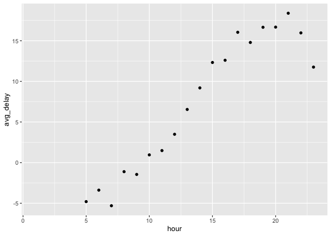
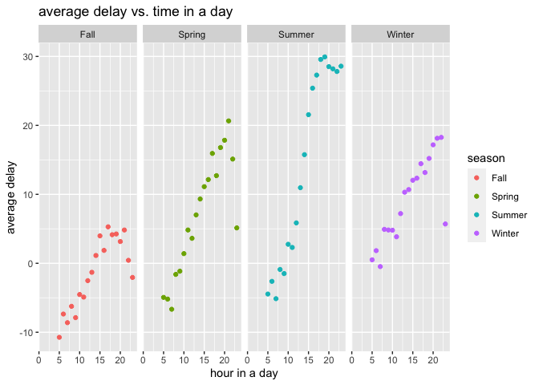
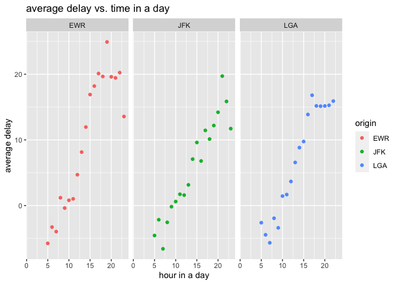
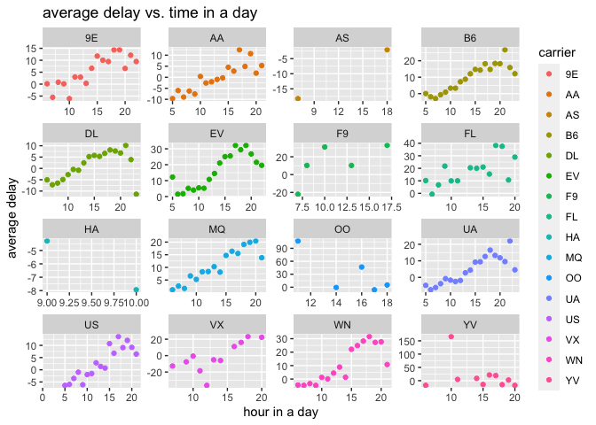

homework-week-5
================
Zechun Zhao
2022-10-10

### General Questions: What time of day should you fly if you want to avoid delays as much as possible? Does this choice depend on anything? Season? Weather? Airport? Airline? Find three patterns (“null results” are ok!). Write your results into Rmarkdown. Include a short introduction that summarizes the three results. Then, have a section for each finding. Support each finding with data summaries and visualizations. Include your code when necessary. This shouldn’t be long, but it might take some time to find the things you want to talk about and lay them out in an orderly way.

##### Introduction: To find the time of a day to fly to avoid delays, passengers are interested in the how arrival delay changes with scheduled departure. A general analysis that excluded the flights with a missing arrival delay data suggests that average arrival delay is the lowest in the morning (5-10 am) and gradually increases as time goes by, it reaches the peak in the evening (8-9 pm) and drops after that. Therefore, it seems that passengers should choose flights that are scheduled to depart in the early morning. This choice does not depend on season, but Fall has the lowest average delays while summer in general has greater delays. This time pattern also stays regardless of the departure airport in NYC. All EWR, JFK, and LGA increase arrival delay through out the day. When looking at whether the choice depends on the carrier, I found that it is not affected for large carriers. But the pattern is not conclusive for smaller carriers that have fewer flights. Therefore the passenger’s decision should depend on flight carrier.

### 1) First, we want to look at the relation between scheduled departure and arrival delay:

``` r
flights_data <- flights

time_delay <- flights_data %>%
  group_by(hour) %>% 
  summarize(avg_delay = mean(arr_delay, na.rm = TRUE)) %>% 
  arrange(avg_delay)

time_delay
```

    ## # A tibble: 20 × 2
    ##     hour avg_delay
    ##    <dbl>     <dbl>
    ##  1     7    -5.30 
    ##  2     5    -4.80 
    ##  3     6    -3.38 
    ##  4     9    -1.45 
    ##  5     8    -1.11 
    ##  6    10     0.954
    ##  7    11     1.48 
    ##  8    12     3.49 
    ##  9    13     6.54 
    ## 10    14     9.20 
    ## 11    23    11.8  
    ## 12    15    12.3  
    ## 13    16    12.6  
    ## 14    18    14.8  
    ## 15    22    16.0  
    ## 16    17    16.0  
    ## 17    19    16.7  
    ## 18    20    16.7  
    ## 19    21    18.4  
    ## 20     1   NaN

``` r
ggplot(data = time_delay) +
  geom_point(mapping = aes(x = hour, y = avg_delay))
```

<!-- -->

``` r
  labs(x = "hour in a day", y = "average delay", title = "average delay vs. time in a day")
```

    ## $x
    ## [1] "hour in a day"
    ## 
    ## $y
    ## [1] "average delay"
    ## 
    ## $title
    ## [1] "average delay vs. time in a day"
    ## 
    ## attr(,"class")
    ## [1] "labels"

##### From the output we can see that morning flights are associated with shorter average delay and delay increases as time goes by in a day. This pattern reaches its peak around 9pm in the evening and drops down.

### 2) Next, we can explore some relation between delay patterns and other variables. First factor to consider is season:

``` r
flight_season <- flights_data %>% 
  mutate(season = case_when(month %in% c(3, 4, 5) ~ "Spring",
                            month %in% c(6, 7, 8) ~ "Summer",
                            month %in% c(9, 10, 11) ~ "Fall",
                            month %in% c(12, 1, 2) ~ "Winter")) %>% 
  group_by(season, hour) %>% 
  summarize(avg_delay = mean(arr_delay, na.rm = TRUE))
```

    ## `summarise()` has grouped output by 'season'. You can override using the
    ## `.groups` argument.

``` r
flight_season
```

    ## # A tibble: 77 × 3
    ## # Groups:   season [4]
    ##    season  hour avg_delay
    ##    <chr>  <dbl>     <dbl>
    ##  1 Fall       5    -10.7 
    ##  2 Fall       6     -7.36
    ##  3 Fall       7     -8.61
    ##  4 Fall       8     -6.24
    ##  5 Fall       9     -7.88
    ##  6 Fall      10     -4.53
    ##  7 Fall      11     -4.90
    ##  8 Fall      12     -2.52
    ##  9 Fall      13     -1.31
    ## 10 Fall      14      1.13
    ## # … with 67 more rows

``` r
ggplot(data = flight_season) +
  geom_point(mapping = aes(x = hour, y = avg_delay, color = season)) +
  facet_grid(col = vars(season)) +
  labs(x = "hour in a day", y = "average delay", title = "average delay vs. time in a day")
```

<!-- -->

##### The graphs grouped by season shows the relation of average delay and the time/hour of a day and whether there is a seasonal pattern. It seems the relation described in the previous section holds true for all seasons: morning flights generally have lower delay and delay increases with as time goes by in a day. However, the overall delay is lower in Fall than the other three seasons. And summer seems to encounter a greater amount of delay. Therefore, the choice of when to fly during a day is not affected by the season. Another pattern to note is the variation of arrival delay throughout the day. Fall and Winter has the lowest variation, suggesting that scheduled departure time does not affect arrival delay to a great degree.

### 3) Second factor we can look at is airport:

``` r
flight_airport <- flights_data %>%
  group_by(origin, hour) %>% 
  summarize(avg_delay = mean(arr_delay, na.rm = TRUE)) %>% 
  arrange(avg_delay)
```

    ## `summarise()` has grouped output by 'origin'. You can override using the
    ## `.groups` argument.

``` r
flight_airport
```

    ## # A tibble: 57 × 3
    ## # Groups:   origin [3]
    ##    origin  hour avg_delay
    ##    <chr>  <dbl>     <dbl>
    ##  1 JFK        7     -6.58
    ##  2 EWR        5     -5.75
    ##  3 LGA        7     -5.67
    ##  4 JFK        5     -4.56
    ##  5 LGA        6     -4.44
    ##  6 EWR        7     -3.96
    ##  7 LGA        9     -3.39
    ##  8 EWR        6     -3.27
    ##  9 LGA        5     -2.61
    ## 10 JFK        8     -2.55
    ## # … with 47 more rows

``` r
ggplot(data = flight_airport) +
  geom_point(mapping = aes(x = hour, y = avg_delay, color = origin)) +
  facet_grid(col = vars(origin)) +
  labs(x = "hour in a day", y = "average delay", title = "average delay vs. time in a day")
```

<!-- -->

##### The pattern of average delay during different hours in a days seems even more uniform across the three airports in New York. The average delay in the evening is slightly higher for EWR. Passengers’ choice of scheduled departure time should not depend on the airport. But avoiding EWR for evening departure can slightly reduce arrival delay.

### 4) At last we look at the third factor carrier:

``` r
flight_carrier <- flights_data %>% 
  group_by(carrier, hour) %>% 
  summarize(avg_delay = mean(arr_delay, na.rm = TRUE)) %>% 
  arrange(avg_delay)
```

    ## `summarise()` has grouped output by 'carrier'. You can override using the
    ## `.groups` argument.

``` r
flight_carrier
```

    ## # A tibble: 207 × 3
    ## # Groups:   carrier [16]
    ##    carrier  hour avg_delay
    ##    <chr>   <dbl>     <dbl>
    ##  1 VX         12     -36.3
    ##  2 F9          7     -22  
    ##  3 VX         11     -18.5
    ##  4 AS          7     -18.2
    ##  5 YV         20     -17.8
    ##  6 YV          6     -17.5
    ##  7 YV         18     -15  
    ##  8 YV         15     -14.4
    ##  9 VX          7     -12.7
    ## 10 DL         23     -11.4
    ## # … with 197 more rows

``` r
ggplot(data = flight_carrier) +
  geom_point(mapping = aes(x = hour, y = avg_delay, color = carrier)) +
  facet_wrap(vars(carrier), scales = "free") +
  labs(x = "hour in a day", y = "average delay", title = "average delay vs. time in a day")
```

<!-- -->

##### The choice of scheduled departure to avoid arrival delay seems to depends on the carrier. The graphs above has adjusted x and y axis depends on the unique available data (depature time and recorded arrival delay) for each carrier. The original pattern stays the same for the large carriers that have more flights such as AA and UA. But there are more fluctuations for the smaller carriers such as OO and YV.
