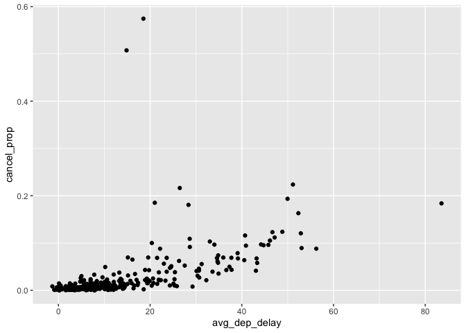

homework-week#3
================
2022-09-27

``` r
library(ggplot2)
library(dplyr)
```

    ## 
    ## Attaching package: 'dplyr'

    ## The following objects are masked from 'package:stats':
    ## 
    ##     filter, lag

    ## The following objects are masked from 'package:base':
    ## 
    ##     intersect, setdiff, setequal, union

``` r
library(nycflights13)
```

``` r
flights_data <- flights
```

1.How many flights have a missing dep_time? What other variables are
missing? What might these rows represent?

``` r
flights %>% 
  filter(is.na(dep_time)) %>% 
  count()
```

    ## # A tibble: 1 × 1
    ##       n
    ##   <int>
    ## 1  8255

``` r
missed_dep_flights <- filter(flights, is.na(dep_time)) 
colnames(missed_dep_flights)[colSums(is.na(missed_dep_flights)) > 0]
```

    ## [1] "dep_time"  "dep_delay" "arr_time"  "arr_delay" "tailnum"   "air_time"

There are 8255 flights with missing departure time, among these flights,
the variables dep_delay, arr_time, arr_delay, tailname, and air_time are
also missing. These rows might represent the flights that never
departed.

2.Currently dep_time and sched_dep_time are convenient to look at, but
hard to compute with because they’re not really continuous numbers.
Convert them to a more convenient representation of number of minutes
since midnight.

``` r
flights %>% 
  transmute(dep_time,  #departure time 
            dep_hour = dep_time %/% 100,  #departure hour
         dep_minute = dep_time %% 100,    #departure minute
         dep_time_in_minutes = dep_hour * 60 + dep_minute,  #representation of departure time in minutes
         sched_dep_time,  #scheduled departure time
         sched_dep_hour = sched_dep_time %/% 100,   #scheduled departure hour
         sched_dep_minute = sched_dep_time %% 100,  #scheduled departure minute
         sched_dep_time_in_minutes = sched_dep_hour * 60 + sched_dep_minute)  #representation of scheduled departure time in minutes          
```

    ## # A tibble: 336,776 × 8
    ##    dep_time dep_hour dep_minute dep_time_in_mi…¹ sched…² sched…³ sched…⁴ sched…⁵
    ##       <int>    <dbl>      <dbl>            <dbl>   <int>   <dbl>   <dbl>   <dbl>
    ##  1      517        5         17              317     515       5      15     315
    ##  2      533        5         33              333     529       5      29     329
    ##  3      542        5         42              342     540       5      40     340
    ##  4      544        5         44              344     545       5      45     345
    ##  5      554        5         54              354     600       6       0     360
    ##  6      554        5         54              354     558       5      58     358
    ##  7      555        5         55              355     600       6       0     360
    ##  8      557        5         57              357     600       6       0     360
    ##  9      557        5         57              357     600       6       0     360
    ## 10      558        5         58              358     600       6       0     360
    ## # … with 336,766 more rows, and abbreviated variable names
    ## #   ¹​dep_time_in_minutes, ²​sched_dep_time, ³​sched_dep_hour, ⁴​sched_dep_minute,
    ## #   ⁵​sched_dep_time_in_minutes

The more convenient format of departure time representation is shown in
the tibble above.

3.Look at the number of canceled flights per day. Is there a pattern? Is
the proportion of canceled flights related to the average delay? Use
multiple dyplr operations, all on one line, concluding with
ggplot(aes(x= ,y=)) + geom_point()

``` r
#The canceled flights are defined as the flights that never departed (with a missing dep_time)
flights %>% 
  group_by(year, month, day) %>% 
  summarize(cancel_count = sum(is.na(dep_time)),
            cancel_prop = cancel_count / n(),
            avg_dep_delay = mean(dep_delay, na.rm = TRUE)) %>% 
  ggplot(aes(x = avg_dep_delay, y = cancel_prop)) + geom_point()
```

    ## `summarise()` has grouped output by 'year', 'month'. You can override using the
    ## `.groups` argument.

<!-- --> According the
graph, we see a general trend that the greater the average departure
delay, the larger the proportion of flights cancelled.

Here is the hyperlink to my Zechun’s github:
<https://github.com/zechun/homework>
